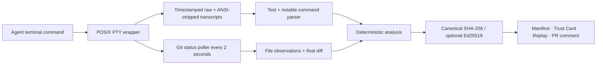

# 🧾 Receipts

**Every AI commit comes with receipts.**

Receipts is an open, agent-agnostic provenance layer for AI-generated code. It wraps a coding-agent terminal session, records the commands, changed files, and test evidence it can observe, then produces an integrity-protected review artifact. The headline finding is deliberately simple: **what did the agent write but never execute?**

See the deployed, recorded sample at [receipts-demo](https://d2hw2ynyop1ius.cloudfront.net/). The public page is static; Receipts itself remains usable offline.

The demo is intentionally **interactive without a backend**: its landing page recomputes the published sample manifest's SHA-256 in the browser, and the replay can filter evidence, scrub the observed timeline, inspect individual events, and load another local Receipts manifest without uploading it anywhere. Static delivery keeps the artifact portable; the captured session facts are the product.

## Judge quickstart — under 60 seconds

Receipts demo needs no API key and makes no network request.

```bash
git clone <your-fork-url> receipts
cd receipts
python3 -m venv .venv
. .venv/bin/activate                 # Windows: use WSL; see below
python -m pip install .
receipts demo
```

You will see a Trust Card, a path to a local static replay HTML file, and a clearly labeled **sample output (generated with GPT-5.6)** review tour. The bundled manifest was recorded by actually wrapping [`tools/fake_agent.sh`](tools/fake_agent.sh), not written by hand.

## 60-second pitch

Code review is drowning in agent output. Diff reviewers tell you what changed; enterprise firewalls tell you what policy allowed. Neither tells a reviewer the session facts: what the agent was asked, what it changed, what it ran, and whether it tested a file *after* editing it.

Receipts supplies that missing evidence. A reviewer gets one Trust Card and can replay the observed timeline. A changed billing file with no test after its last observed edit is not a hunch—it is a red `NEVER EXECUTED` receipt.

## Use it with any coding agent

```bash
# macOS/Linux/WSL
receipts run --task "fix the login redirect bug" -- codex "fix the login redirect bug"
receipts card
receipts replay
receipts verify session-<id>
```

`run` accepts any executable: `codex`, `claude`, a shell script, or another coding agent. It records the exact argv and labels the executable as `codex`, `claude`, `cursor`, or `other`.

`replay` writes a single static HTML file beside the manifest and asks the system browser to open it. Use `--no-open` in CI/headless environments.

### Optional signed receipts

All manifests carry a canonical SHA-256 hash. Ed25519 signing is optional and never required for the core flow:

```bash
python -m pip install cryptography
receipts keygen
receipts run --task "harden auth" -- codex "harden auth"
receipts verify session-<id>
```

`keygen` writes project-local keys under `.receipts/keys/`; the private key is not committed by the provided `.gitignore`.

### Optional GPT review tour

Without an API key, `receipts tour` prints the bundled sample. With `OPENAI_API_KEY`, it uses the Responses API for a risk-ranked tour. The core recorder, verifier, card, replay, and demo are all offline. The live request sets `store: false`; live API availability and model access remain account-dependent.

## What a session records



Each `.receipts/session-<id>.json` contains:

- session metadata: timestamps, cwd, full argv, agent label, branch, base commit, task;
- Git snapshots and per-file first/last observed changes;
- parsed test invocations and results for pytest, Jest, Vitest, Go, Cargo, npm/pnpm/yarn, and Make;
- notable Git, package-install, and `curl`/`wget` commands;
- final changed-file stats, analysis, hash, and optional signature.

## Deterministic review signals

| Signal | Evidence rule |
|---|---|
| ✅ verified | A convention-mapped test passed after the file’s last observed edit. |
| 🟡 indirectly exercised | Some passing suite ran after the last observed edit, but no mapped test was seen. |
| 🔴 NEVER EXECUTED | No passing test was observed after the file’s last observed edit. |
| Scope drift | Heuristic token mismatch between task and changed source path. |
| Risk hint | Sensitive path, dependency/project manifest, migration, workflow, environment file, or observed network egress. |

## GitHub Action

The composite Action finds the newest manifest and creates or updates one sticky PR comment marked `<!-- receipts-trust-card -->`.

```yaml
- uses: your-org/receipts/action@v0
  with:
    github-token: ${{ secrets.GITHUB_TOKEN }}
```

See [`examples/receipts-pr.yml`](examples/receipts-pr.yml). The action’s POST and PATCH behavior is covered by an offline mocked-API test.

## Optional: public AWS demo

Receipts does not need a cloud backend. If you want a judge-ready public link, M6 deploys **only** the curated static `docs/` site through a private S3 bucket and CloudFront HTTPS. The S3 origin remains private; GitHub Actions receives short-lived AWS credentials through a role restricted to one exact OIDC subject, rather than using stored AWS access keys.

The full cost-guardrail, CloudFormation, GitHub OIDC, verification, and cleanup guide is in [`AWS_DEPLOY.md`](AWS_DEPLOY.md). Do not deploy raw `.receipts/` content or user session data to this public showcase.

## Comparison

| Approach | Primary question | What Receipts adds |
|---|---|---|
| Diff re-reviewers (e.g. CodeRabbit) | “What looks wrong in this diff?” | Session facts: commands, test ordering, and unexecuted changes. |
| Enterprise agent firewalls (e.g. LlamaFirewall, Aegis) | “Should this agent action be allowed?” | Post-session reviewer evidence, independent of agent vendor. |
| Session attach tools (e.g. Warp) | “How do I work in this terminal now?” | A durable, tamper-evident receipt attached to the resulting change. |

## Honest limitations

- **macOS/Linux/WSL only.** Receipts uses stdlib `pty`; Windows-native support is intentionally out of scope. Run it in WSL on Windows.
- **Polling observes, not omniscience.** File times are observed at a two-second Git-poll cadence, not editor-save timestamps.
- **Transcript parsing is conservative.** If a runner command or result cannot be identified confidently, it is marked `unparsed`, never guessed.
- **Verification is convention-based.** Mapping covers `test_x.py ↔ x.py`, `x.test.ts`/`x.spec.ts ↔ x.ts`, and `x_test.go ↔ x.go`; indirect coverage is not a proof of behavioral coverage.
- **Scope drift is a heuristic.** It uses task/path tokens with a small `login ↔ auth` alias, and must be read as a prompt for review—not an authorization decision.
- **Integrity proves manifest mutation, not every external fact.** Hashing makes later manifest edits detectable; it cannot prove an unobserved process or side effect never occurred.
- **Live tour is optional.** No key means no network call and a labeled bundled sample; the live API branch is not exercised by the offline demo.

## How Codex & GPT-5.6 built this

We worked milestone by milestone and committed each one separately:

1. **Capture core:** GPT-5.6 chose a POSIX PTY plus Git snapshot model so the receipt retains raw evidence and a compact per-file summary. A real fake-agent recording exposed Git’s untracked-directory collapse, which we fixed using `--untracked-files=all` rather than guessing file contents.
2. **Deterministic analysis:** GPT-5.6 designed the three-tier verification gap and conservative parser fixtures. A real PTY transcript exposed timestamp injection around pytest progress; the parser was fixed against the ANSI-stripped transcript and regression-tested.
3. **Reviewer artifacts:** GPT-5.6 rendered the card from recorded facts only and made sticky-comment create/update logic mockable without calling GitHub.
4. **Demo:** GPT-5.6 analyzed the real dogfooded session to write the sample tour. It deliberately labels the output as generated with GPT-5.6, rather than pretending an offline call was live.
5. **Public demo (optional):** GPT-5.6 kept the live showcase separate from the product's core. It deploys only the curated static demo through private S3, CloudFront HTTPS, and a least-privilege GitHub OIDC role—no server, database, or long-lived AWS key.

The full chronological decision record is in [`BUILDLOG.md`](BUILDLOG.md).

## Development

```bash
python -m pip install pytest
python -m pytest -q
```

The current suite covers transcript fixtures, verification analysis, integrity/tamper checks, Trust Card rendering, mocked Action create/update behavior, replay embedding, tour fallback, and the offline demo.
